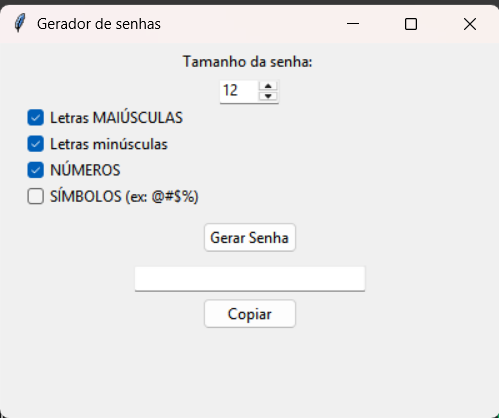

# 🔐 Gerador de Senhas com Interface Gráfica

Este é um projeto simples e funcional de **gerador de senhas seguras** desenvolvido com **Python** e **Tkinter**. O usuário pode personalizar o tipo de senha que deseja gerar, escolhendo:

- Letras maiúsculas
- Letras minúsculas
- Números
- Símbolos
- E o tamanho da senha (de 4 a 64 caracteres)

---

## 🖥️ Interface

A aplicação possui uma interface gráfica amigável onde você pode:

- Marcar ou desmarcar tipos de caracteres
- Escolher o tamanho da senha
- Gerar a senha com um clique
- Copiar a senha com o botão “Copiar”

---

## 🛠️ Tecnologias usadas

- Python 3.12
- Tkinter (GUI)
- String (biblioteca nativa)
- Random (biblioteca nativa)

---

## Como executar o arquivo do projeto 🚀
1. Clone o repositório
   
   git clone https://github.com/GuiDev-01/gerador-senhas.git
   
3. Acesse a pasta do projeto

   cd gerador-senhas
   
5. Execute o arquivo principal

   python main.py

### 🧑‍💻 Desenvolvido por Antônio Guilherme

https://www.linkedin.com/in/ant%C3%B4nio-guilherme-56a3b9305/

https://github.com/GuiDev-01

Projeto pessoal criado com o objetivo de consolidar meus conhecimentos em python e interface gráfica.
